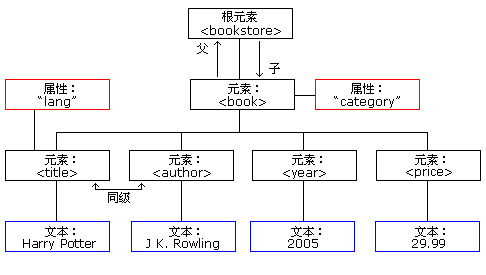

## XML 文档形成一种树结构

XML 文档必须包含**根元素**。该元素是所有其他元素的父元素。

XML 文档中的元素形成了一棵文档树。这棵树从根部开始，并扩展到树的最底端。

所有的元素都可以有子元素

### 实例

```xml
<bookstore>
    <book category="COOKING">
        <title lang="en">Everyday Italian</title>
        <author>Giada De Laurentiis</author>
        <year>2005</year>
        <price>30.00</price>
    </book>
    <book category="CHILDREN">
        <title lang="en">Harry Potter</title>
        <author>J K. Rowling</author>
        <year>2005</year>
        <price>29.99</price>
    </book>
    <book category="WEB">
        <title lang="en">Learning XML</title>
        <author>Erik T. Ray</author>
        <year>2003</year>
        <price>39.95</price>
    </book>
</bookstore>
```



根元素是 \<bookstore>。

文档中的所有 \<book> 元素都被包含在 \<bookstore> 中。

\<book> 元素有 4 个子元素：\<title>、\<author>、\<year>、\<price>

